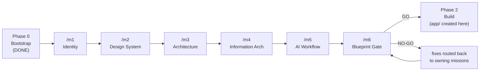
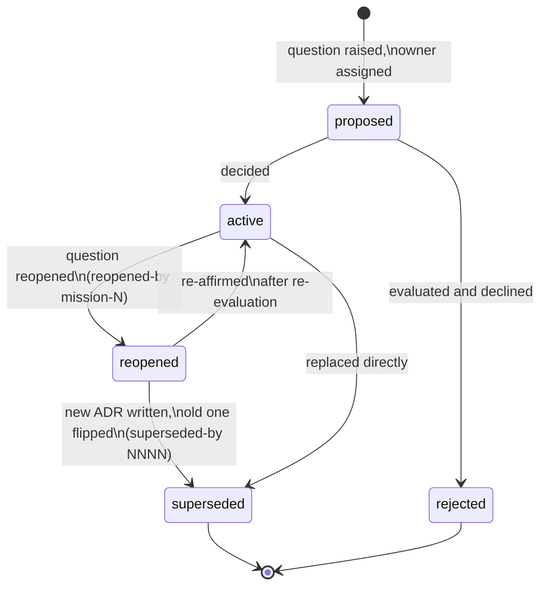
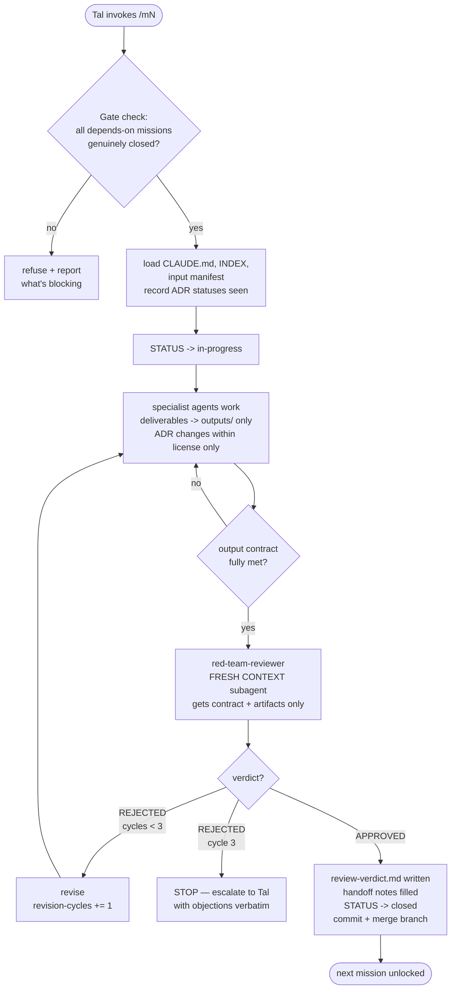
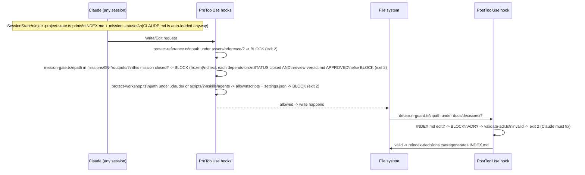

# The Handbook — how this project works

Written for Tal. Everything in one place: what this repo is, how its parts
relate, and how to operate it day to day. Diagrams are embedded as Mermaid
(render in VS Code with a Mermaid extension, or on GitHub); this file is
their only home (ADR 0031 retired the extraction machinery).

---

## 1. What this repo is

Two things, in sequence:

1. **Right now: a decision workshop.** A mission-driven process that produces a
   complete, adversarially-reviewed blueprint for the portfolio — identity,
   design system, architecture, IA, dev workflow — _before any app code exists_.
2. **Later: the portfolio itself.** `app/` gets created at the start of
   Phase 2, per whatever Mission 3 decided. Whether it stays in this repo is
   itself an open decision (ADR 0013).

The workshop machinery is deliberately part of the portfolio's story: ADRs,
gates, hooks, and agents demonstrate engineering process in public.

### The three phases



Strictly sequential — your decision. Each arrow is a _mechanical_ gate, not a
convention (see §6).

---

## 2. The five building blocks

| Block               | Lives in                                | What it is                                                                                        | Mutable?                                       |
| ------------------- | --------------------------------------- | ------------------------------------------------------------------------------------------------- | ---------------------------------------------- |
| **ADRs**            | `docs/decisions/`                       | The single source of truth for every decision — status in frontmatter, never moved, never deleted | Status flips only; new conclusions = new files |
| **Missions**        | `.claude/skills/m*/` + `missions/0N-*/` | Procedure (skill) + workspace (STATUS, outputs) — function vs call site                           | Skill: rarely. Workspace: constantly           |
| **Skills**          | `.claude/skills/`                       | Reusable capabilities and the 6 mission procedures                                                | Sessions may edit (ADR 0028)                   |
| **Agents**          | `.claude/agents/`                       | Role definitions: `red-team-reviewer` + `docs-explorer` (specialists deleted at Phase 2 open, ADR 0030 — provenance in `docs/EVOLUTION.md`) | Sessions may edit (ADR 0028)                   |
| **Hooks + scripts** | `.claude/settings.json` → `scripts/`    | Mechanical enforcement: TypeScript, zero deps, Node native type-stripping                         | **Never** by sessions — you may edit what the enforcement layer checks, not the checker (ADRs 0028, 0032) |

### Who reads and writes what

```mermaid
%% id: file-relations
flowchart TB
    subgraph CONFIG[".claude/ — loaded as configuration"]
        CM["CLAUDE.md\n(auto-loaded constitution)"]
        SK["skills/\ncapability + 6 mission"]
        AG["agents/\n1 judgment + 1 worker"]
        SET["settings.json"]
    end

    subgraph ENFORCE["scripts/ — mechanical enforcement"]
        H1["hooks/protect-reference.ts"]
        H2["hooks/mission-gate.ts"]
        H3["hooks/decision-guard.ts"]
        H4["hooks/inject-project-state.ts"]
        H5["hooks/protect-workshop.ts"]
        V["validate-adr.ts"]
        W["validate-workshop.ts"]
        R["reindex-decisions.ts"]
        T["test-machinery.ts"]
        LIB["lib/frontmatter.ts"]
    end

    subgraph TRUTH["docs/ — source of truth"]
        ADR["decisions/*.md (ADRs)"]
        IDX["decisions/INDEX.md\n(GENERATED)"]
        RES["research/\n(about-tal, CV, mythology notes)"]
    end

    subgraph WORK["missions/ — live state"]
        PLAN["00-mission-plan.md"]
        ST["0N-*/STATUS.md"]
        OUT["0N-*/outputs/"]
    end

    REF["assets/reference/\nprototypes (committed)\ninspiration (gitignored)"]

    SET --> H1 & H2 & H3 & H4 & H5
    H5 -->|guards writes to| SK & AG & SET
    W -->|lints| SK & AG
    H2 -->|reads| ST
    H2 -->|checks verdict in| OUT
    T -->|drives every hook,\nasserts exit codes| ENFORCE
    H3 -->|runs| V --> LIB
    H3 -->|runs| R -->|writes| IDX
    R -->|reads frontmatter| ADR
    H4 -->|injects| IDX & ST
    H1 -->|blocks writes to| REF
    SK -->|input manifests point at| ADR & RES & REF & OUT
    AG -->|write deliverables to| OUT
    AG -->|write/flip| ADR
    CM -->|points to| IDX
```



---

## 3. The ADR system

One flat directory. A decision's **identity is its number**; its **state is a
frontmatter field**. Files never move, never get deleted, never have their
reasoning edited after the fact.



Rules that matter in practice:

- **New conclusion = new ADR.** Never rewrite an old one; flip it to
  `superseded` with a pointer. Superseded ADRs are your rejection log —
  history is the point.
- Missions may **act on `active`** ADRs only. `reopened` = open question
  (prior conclusion is input, not law). `proposed` = don't build on it.
- `INDEX.md` is **generated** (`node scripts/reindex-decisions.ts`). Never
  hand-edit; on merge conflict, regenerate.
- Frontmatter is **flat** `key: value` only — this constraint is what lets the
  validator stay dependency-free.
- **Partial narrowing** (ADR 0027): when a new ADR corrects one *clause* of an
  older one that otherwise still stands, neither `superseded` nor `reopened`
  fits. The newer gets `narrows: NNNN`, the older gets `narrowed-by: NNNN` and
  stays `active`. Both sides are required — `validate-adr.ts` (full-repo mode)
  fails on a one-directional relation. It shows up in the `Note` column, which
  every session receives. Live: 0023 narrows 0019, 0024 narrows 0020.
- Relational frontmatter (`superseded-by`, `reopened-by`, `narrowed-by`) is
  metadata and **is** written into old ADRs after the fact. Their *reasoning*
  is what never gets edited.

Snapshot at Phase 0 close (live truth: `INDEX.md`, regenerated on every ADR
write): **4 active** (0001 identity mark, 0002 easter-egg mechanism,
0011 RTL, 0012 showcase constraints) · **8 reopened** · **1 proposed** (0013
repo topology → M3). Full table: `docs/decisions/INDEX.md`.

---

## 4. Anatomy of a mission

Every mission = **procedure** (the skill, invoked as `/m1`…`/m6`) +
**workspace** (`missions/0N-*/`). Every mission skill follows the same
template (see `prompt-craft`): role → memory block → starting state → input
manifest → output contract → scope boundaries → stop conditions → checkpoints.

The run, end to end:



Key protections baked into that loop:

- The **reviewer never sees the producing conversation** — fresh context only,
  so it can't inherit the mission's blind spots. It writes
  `outputs/review-verdict.md` itself; the mission may never write its own.
- **Loop cap of 3.** Persistent disagreement between producer and reviewer is
  signal you should see, not noise to grind away.
- **"Closed" requires evidence.** Flipping STATUS.md alone unlocks nothing —
  the gate also demands the APPROVED verdict file (§6).

### What each mission owns

| Mission             | Decides                                                                                                      | ADR license               | Notable rules                                                                                                  |
| ------------------- | ------------------------------------------------------------------------------------------------------------ | ------------------------- | -------------------------------------------------------------------------------------------------------------- |
| M1 Identity         | Identity thesis; mythology reconciliation (spine / layer / rejected); fate of 0002                           | 0001, 0002                | Checkpoint 0: asks you for mythology input if notes absent; no colors/fonts/routes                             |
| M2 Design System    | Palettes, typography, tokens, motion; hero concept (0007) and illustration role (0008)                       | 0004–0008                 | M1 outputs are law; Hebrew font coverage verified, not assumed                                                 |
| M3 Architecture     | Stack (0003 re-run from first principles); dynamic boundary for SQL/Docker/CI-CD/cloud; repo topology (0013) | 0003, 0013 + new          | **Must not read M2 outputs** — architecture isn't decided by mood; paper only, no scaffolding                  |
| M4 Information Arch | Routes, content model, translated-articles placement (0010), theme-model inconsistency in 0009               | 0009, 0010 + new          | RTL behavior specified precisely                                                                               |
| M5 AI Workflow      | Phase 2 workflow, hooks, worktree call, plugin packaging                                                     | workflow ADRs             | The only mission allowed to modify `.claude/`                                                                  |
| M6 Blueprint Gate   | GO / NO-GO for Phase 2                                                                                       | flags only, flips via you | Security + performance skills in **design mode**; its own outputs get red-teamed by a second reviewer instance |

---

## 5. The skills catalog

**Capability skills.** Eight of these are the reusable set specified for the
`portfolio-workshop` plugin — **specified at 0.1, deliberately not published**
(ADR 0029, `plugin-spec.md`). Still eight, but a *different* eight than this
section once promised: `brand-voice` was reclassified *out* (it is a project
brand book, not a method) and `review-work` joined. `publish-translation` stays
too — it encodes one named author's licence terms. The escalation-target
parameter headers were stripped at Phase 2 open (ADR 0032): parameterizing for
a consumer that doesn't exist is overhead; re-add them if the plugin ever
ships.

| Skill                | One-liner                                                                                                                      |
| -------------------- | ------------------------------------------------------------------------------------------------------------------------------ |
| `adr-keeper`         | ADR format, lifecycle, and the never-edit/never-delete rules                                                                   |
| `tech-eval`          | First-principles evaluation: requirements before candidates, incumbent included, versions verified by search, honest tradeoffs |
| `design-tokens`      | How palettes/type ship as semantic CSS variables; restraint rules; RTL checks                                                  |
| `brand-voice`        | Identity invariants; the anti-theme-soup rule for new symbolic layers — **project artifact, does not travel** (ADR 0029)      |
| `prompt-craft`       | The mission-prompt template (patterns adapted from prompt-master: start/target state, stop conditions, scope, memory block)    |
| `mission-protocol`   | The run sequence in §4; gate, loop cap, closure rules                                                                          |
| `security-review`    | Dual-mode: design (threat-model the blueprint, M6) / code (Phase 2 CI)                                                         |
| `performance-review` | Dual-mode: design (budgets with numbers, M6) / code (CI enforcement)                                                           |
| `review-work`        | Phase 2 adversarial review of a work item; carries `context: fork`, so reviewer isolation is mechanical rather than promised   |
| `publish-translation`| Publish-time licence checklist for a Hebrew translation, incl. the upstream back-link PR — **project artifact, does not travel** |

**Mission skills**: `m1-identity` … `m6-blueprint-gate`, each with
`disable-model-invocation: true` — they run only when _you_ type the slash
command; Claude can never auto-trigger a mission mid-conversation.

**Agents**: two remain — `red-team-reviewer` (judgment: adversarial review,
always fresh context, methods preloaded via `skills:`) and `docs-explorer`
(worker: parallel documentation and version lookup, self-contained Workflow +
Output format, pinned cheaper model). **The six Phase 1 specialists were
deleted at Phase 2 open** (ADR 0030, narrowing 0025): retirement = deletion;
provenance = git history + `docs/EVOLUTION.md`, which records what each was
and which ADRs are its durable output. No new agents (ADR 0025 decision 6).
Contrast math is not a model task and belongs to `scripts/contrast.ts`, which
exits 1 on AA failure so Phase 2 CI can gate on it.

---

## 6. The enforcement layer

Instructions can be ignored under context pressure; hooks can't. Five hooks,
all TypeScript run directly by Node (≥24 guaranteed; type-stripping — no build
step, no dependencies; `enum`/`namespace` forbidden because stripping can't
erase them).



What each blocks, in plain words:

- **protect-reference** — nobody edits your prototypes or inspiration. Ever.
- **mission-gate** — no mission produces outputs while its dependency chain
  isn't _genuinely_ closed. The rubber-stamp loophole is dead: a STATUS flip
  without the reviewer's APPROVED verdict file does not count. It now also
  guards the other direction: **a closed mission's outputs are frozen** (ADR
  0028). Those deliverables are the specs Phase 2 is measured against, and a
  spec that can be quietly edited to match the code is not a spec. A wrong
  closed deliverable is a new ADR, not an edit.
- **decision-guard** — malformed ADRs bounce back with the reason; INDEX.md
  can't be hand-edited; every valid ADR write auto-regenerates the index.
- **inject-project-state** — every fresh session starts already knowing the
  decision index and where every mission stands.
- **protect-workshop** — the machinery guards itself, one static rule
  (ADR 0028, simplified by ADR 0032): sessions may edit `.claude/skills/**`
  and `.claude/agents/**` — instructions, which fail soft and which
  `node scripts/validate-workshop.ts` lints — but never `scripts/hooks/**`,
  `scripts/*.ts` or `settings.json`, which are the enforcement layer and fail
  **open and silently** when broken. _You may edit what the enforcement layer
  checks; you may not edit the checker._ You are exempt: hooks bind Claude
  Code sessions, not your editor.
  (Docs staleness enforcement — the old `docs-sync-check` hook and its
  `sync-docs.ts` fingerprint/extraction tool — retired at Phase 2 open,
  ADR 0031. This handbook is now kept honest by reading, not by a hook.)

One more script, not a hook, backs this up:

- **test-machinery.ts** — the smoke suite the enforcement layer never had
  (`IMPROVEMENTS.md` #2), driving all five hooks exactly as a session does
  (JSON on stdin) and asserting exit codes — including the rubber-stamp case
  (closed **without** a verdict) and ADR 0027's one-directional narrowing.
  Cases that can't exist in the real repo run against throwaway fixture
  mission trees. The phase table is gone with the phase regimes (ADR 0032):
  protect-workshop's static rule is asserted directly. **CI's first job** — a
  repo whose enforcement is broken shouldn't spend runner minutes on anything
  else. It is a smoke suite, not a proof: it catches a hook that stopped
  blocking, not one that blocks the wrong thing in a case nobody listed.

---

## 7. Operating manual

**Run a mission:** open Claude Code in the repo → type `/m1` (etc.) → the
skill carries everything: gate check, inputs, contract, stop conditions. You
don't write prompts; you invoke them.

**When the reviewer rejects:** normal, up to 3 cycles. On the third rejection
the mission stops and hands you the objections verbatim — you arbitrate.

**When you're asked to escalate:** the mission hit something outside its
license (an ADR flip it doesn't own, an identity conflict, a budget change).
Decide, answer in chat, the mission continues.

**Branching:** branch per mission, merge on close, never delete the branch.
In Phase 2: `<track>/<slug>` branches through PRs, squash-merged (ADR 0026).
**Worktrees: decided — not used by default.** The test is "does this task run
the app?"; if yes, same working tree. If `INDEX.md` conflicts on merge:
`node scripts/reindex-decisions.ts`, commit, done — never hand-merge it.

**Adding source material anytime:** notes → `docs/research/` · your own
artifacts → `assets/reference/prototypes/` · third-party → `inspiration/`
(gitignored; never a hard dependency of any contract).

**Useful commands:**

```bash
node scripts/test-machinery.ts          # smoke-test every hook (CI's first job)
node scripts/validate-adr.ts            # all ADRs + narrowing reciprocity
node scripts/validate-adr.ts <path>     # validate one (shape only)
node scripts/reindex-decisions.ts       # regenerate INDEX.md
node scripts/hooks/inject-project-state.ts  # preview what sessions see
node scripts/validate-workshop.ts       # lint skills + agents structure
```

**Gotchas already learned so you don't relearn them:**

- Verify npm versions by web search before writing any package.json (rule
  lives in `tech-eval`; hard-won).
- No bash brace expansion for directory creation.
- `@astrojs/tailwind` is deprecated for Tailwind 4 — `@tailwindcss/vite` in
  `vite.plugins` (relevant only if M3 keeps Astro).
- Scripts: erasable TypeScript only — union types instead of enums.

---

## 8. Where things stood at Phase 0 close

(Point-in-time section, deliberately dated 2026-07-20. Live state = the
session injection: INDEX.md + STATUS files.)

Phase 0: **closed.** All 13 ADRs decomposed and signed off (0007/0008 deferred
to M2 per your call). Bio + CV + prototypes in place. Hooks tested: reference
writes blocked, gate blocks M2 while M1 is open, closed-without-verdict
correctly rejected, validation and reindex green.

Next action, in order: _(optional)_ `docs/research/greek-mythology-notes.md`
→ `git init` + commit → `/m1`. If you skip the notes, Mission 1's Checkpoint 0
will ask you before exploring — that's by design.
